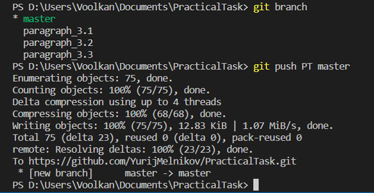

# **Основы работы с Git в Visual Studio Code** #

## **Введение** ##

*Visual Studio Code* - бесплатный и удобный редактор исходного кода. Поддерживает ряд языков программирования, подсветку синтаксиса, рефакторинг, отладку, навигацию по коду, поддержку Git и другие возможности. Так же доступно большое количество расширений, для индивидуальной настройки *VS Code* под определённые задачи и языки программирования, что ещё больше расширяет круг возможностей данной программы. 

*Git* - система управления версиями с распределенной архитектурой. В отличие от некогда популярных систем вроде CVS и Subversion (SVN), где полная история версий проекта доступна лишь в одном месте, в *Git* каждая рабочая копия кода сама по себе является репозиторием. Это позволяет всем разработчикам хранить историю изменений в полном объеме.

Разработка в *Git* ориентирована на обеспечение высокой производительности, безопасности и гибкости распределенной системы.

Система *Git* была изначально разработана в 2005 году Линусом Торвальдсом — создателем ядра операционной системы Linux. *Git* применяется для управления версиями в рамках колоссального количества проектов по разработке ПО, как коммерческих, так и с открытым исходным кодом. Система используется множеством профессиональных разработчиков программного обеспечения. Она превосходно работает под управлением различных операционных систем и может применяться со множеством интегрированных сред разработки (IDE).

## **1.  Начальная настройка, базовые функции и команды** ##

### 1.1 Установка и начальная настройка Visual Studio Code и Git в OS Windows ###

Загрузить *Visual studio code* для нужной платформы можно по [ссылке](https://code.visualstudio.com/Download "https://code.visualstudio.com/Download"). Каких либо особых настроек при установке не требуется. 

Загрузить *Git* для нужной платформы можно с  [официального сайта](https://git-scm.com/downloads "https://git-scm.com/downloads"). При установке обязательно убедиться, что параметр при установке:

>*Choosing the default editor used by Git*

выбран

>*Use Visual Studio Code as Git's default editor*,

в противном случае команды *Git* в терминале *VS Code* работать не будут (актуально на для платформы Windows). См. скриншот ниже:

остальные настройки при установке оставить "по умолчанию".

После установки *VS Code* и *Git* проверим, успешно ли *Git* был интегрирован в *VS Code*. Откроем терминал в *VS Code*: *Terminal -> New Terminal* или сочетанием клавиш "*Shift+Ctrl+~*". В командной строке терминала введём команду:
>git --version 

или

>git -v

если отобразилась версия *Git*, то установка прошла успешно.

Далее, следует ввести данные пользователя *Git*, от имени и электронной почты которого, будет идти работа.
>git config --global user.name <"имя пользователя">

>git config --global user.email <электронная почта пользователя>

Проверить корректность введённых данных можно командой:

>git config --global --list

### 1.2 Использование внутренней справки ### 

В *git* существует многоуровневая локальная справка.

Краткое описание базовых команд *Git*:

>git help

>git -h

>git --help

Развёрнутая справка, в html формате об указанной команде, 

>git help <команда> 

>git --help <команда>

>git -h <команда>

например *git help add*; *git -h init* ит.д.

Так же, для просмотра только опций к команде, можно использовать параметр -h в формате:

>git команда -h

например: *git add -h*; *git checkout -h* ит.д.

### 1.3 Создание репозитория Git ###

Репозиторий (от англ. repository - хранилище) - это папка со всеми файлами, находящимися под контролем версий, вместе с историей их изменения и другой служебной информацией.

Для создания репозитория, необходимо сделать активной папку в терминале, где нужно его создать:

>cd <"путь к папке">

например: *cd "D:\Users\Voolkan\Documents\PracticalTask"*

и ввести команду

>git init

Эта команда создаёт в активном каталоге новый подкаталог с именем .git, содержащий все необходимые файлы репозитория - структуру Git репозитория. На этом этапе проект ещё не находится под версионным контролем. Подробности в следующем параграфе

Так же есть возможность, клонировать, полностью скопировать, удалённый репозиторий командой:

>git clone \<url> 

где url - интернет адрес репозитория. 

### 1.4 Сохранение состояний репозитория, коммиты ###

Коммитом (англ. commit - фиксировать) - в *git* называют сохранение состояния отслеживаемых файлов в репозитории. При этом *git* не просто делает копию отслеживаемых файлов, а фиксирует изначальное и изменённое состояние файла. Можно возвращать состояние файла от одной контрольной точки - коммита, до другой - в этом и есть основное назначение контроля версий.

Прежде, чем создавать коммит, необходимо добавить файл для отслеживания *git* командой:

>git add <имя файла>

Что бы определить, какие файлы были добавлены в репозиторий или имеют изменения, существует команда:

>git status

Красным выделяются не отслеживаемые файлы, зелёным добавленные в отслеживание, но не сохранённые в репозитории файлы

После добавления в отслеживание файла, можно создавать коммит командой:

>git commit -m "Комментарий"

где -m, параметр для создания комментария к коммиту, для удобства понимания, какие изменения вносит этот коммит. Первый коммит принято комментировать *"Initial commit"*

Например:

>git status

Изменённый и не отслеживаемый файл conspectus.md

Добавляем его и проверяем статус:

>git add conspectus.md
>>git status

Создаём коммит:

>git commit -m "Working with paragraph 1.4"

и проверяем текущий статус

>git status

Подробнее о переключении между состояниями репозитория - коммитами, в параграфе 1.6
### 1.5 Работа с журналом ###

В git существует возможность вывода журнала изменений в различных форматах.

История коммитов в базовом, подробном формате:

>git log 

История последних "n" коммитов

>git log -n

например: *git log -2*; информация о последних двух коммитах

Вывод истории коммитов в краткой, удобной построчной форме:

>git log --oneline

Вывод истории коммитов, с информацией работы с ветками:

>git log --graph

Так же в *git* есть возможность отслеживать не только базовую информацию о коммитах, но и об подробных изменениях, внесёнными этими коммитами

Команда, показывающая внесённые изменения последним коммитом:

>git show

Одной из самых полезных команд является:

>git log -p -n

Вывод изменений, внесёнными последними n коммитами, например *git log -p -2*; вывод изменений последних двух коммитов.

Для вывода изменений определённого коммита, существует команда:

>git diff <hash code>

где hash code - хэш-код выбранного коммита, для вывода его изменений.

### 1.6 Переход между разными сохранёнными состояниями репозитория - коммитами ###

Каждый коммит имеет свой уникальный идентификатор - хэш-код, который можно узнать из журнала *git log*
Для перехода между состояниями репозитория, коммитами существует команда:

>git checkout <hash_code>

где hash code - уникальный идентификатор, хэш-код коммита, к состоянию которого перейдёт проект после выполнения команды. Достаточно первых четырёх символов, для идентификации коммита. Таким образом, можно возвращаться на предыдущие ступени работы над проектом, если в текущей версии есть неразрешимые проблемы.

Команда, возвращающая к последнему внесённому коммиту:

>git checkout master

## 2. Создание и работа с ветками. Конфликты при слиянии ##

### 2.1 Назначение веток в Git. Создание новых веток ###

В *git* существует полезная функция - создание многоуровневых ветвлений проекта, которая предназначена: во-первых, для создания копии основного проекта, в которой можно изменять, дополнять и тестировать без опасений навредить проекту; во-вторых, для организации коллективной работы над проектом, когда каждый человек выполняет ту или иную задачу в своей ветке, которые потом сливаются в цельный проект.

Для создания ветки нужно ввести команду:

>git branch <имя_ветки>

создаётся ветка c заданным именем, точная копия активной (в базовом случае основной). Для просмотра существующих веток нужно ввести команду выше без модификаторов:

>git branch

отобразится список существующих веток и звёздочкой будет помечена активная, в которой идёт работа и сохраняются коммиты.

Для перехода в нужную ветку используется команда:

>git checkout <имя_ветки>

соответственно, для перехода в основную, к последнему в ней коммиту:

>git checkout master

Так же удобна команда, просмотра последнего коммита в каждой ветке:

>git branch -v

Если нужно  переименовать ветку, можно воспользоваться командой:

>git branch --move имя_ветки новое_имя_ветки

Не рекомендуется, без крайней необходимости, переименовывать основную master ветку, в процессе работы над проектом.

### 2.2 Слияние и удаление веток ###

Когда работа в дополнительной ветке окончена, её можно объединить с основной или другой веткой, на основе которой была создана дополнительная. Используется команда:

>git merge <имя_ветки>

где имя_ветки, название ветки которую объединяют с основной.
Важно, чтобы ветка, в которую вливается дополнительная, в момент слияния была выбрана активной.

После слияния, ветку, которую объединяли с активной можно удалить:

>git branch -d <имя_ветки>

Если результат работы в дополнительной ветке не нужен, можно принудительно удалить дополнительную ветку, без слияния - параметром *-D*

>git branch -D <имя_ветки>

Так же можно посмотреть какие ветки были объединены, а какие нет. Соответственно для просмотра веток, которые не объединялись:

>git branch --no-merged

и для успешно объединённых 

>git branch --merged

### 2.3 Конфликты при слиянии, причины их возникновения и их устранение ###

Если изменена одна и та же часть одного и того же файла по-разному в двух объединяемых ветках, Git не сможет их чисто объединить. Возникает конфликт и процесс слияния приостанавливается до устранения конфликта.

В Visual Studio Code конфликт слияния можно решить в удобной, наглядной графической форме:

 текущий вариант в основной, активной ветке:

><<<<<<< Head (Current Сhange)

вариант изменений, предлагаемый вливаемой веткой:

> \>>>>>>> "Название ветки" (Incoming Сhange)

Есть несколько вариантов для слияния: Accept Current Сhange - оставить всё, как было в активной ветке, до слияния.  Accept Incoming Сhange - принять вариант из вливаемой ветки. Accept Both Changes - принять совмещённый вариант, где будут отражены оба варианта.

Гораздо надёжнее можно контролировать процесс слияния при использовании Merge Editor (Resolve in Merge Editor).

Результат слияния будет виден в окне Result, в зависимости от выбранного варианта.

Если пользователь не готов к решению конфликтов, попытку слияния можно отменить:

>git merge --abort

 Разрешение конфликтов при слиянии важный и ответственный аспект работы над проектом, стоит внимательно рассматривать каждый случай конфликта и вручную его разрешать. 

## 3. Работа с удалёнными репозиториями на примере github.com ##

### 3.1 Создание удалённого репозитория на github.com и загрузка в него локального репозитория ###

Для организации коллективной работы над проектом, *git* имеет мощный инструментарий для работы над удалёнными репозиториями. Удалённый репозиторий может быть, как на личном компьютере, так и сервере локальной сети или в облачном сервисе. Одним из самых популярных интернет ресурсов для работы с удалёнными репозиториями является *github.com*, где сообщество программистов делится собственными наработками, улучшает и модифицирует уже имеющиеся репозитории ит.д. 

Для создания репозитория на *github.com* нужно перейти во вкладку *your repositories* и кликнуть *new*, в следующем окне ввести название репозитория, указать дополнительные настройки (видимость репозитория, добавление описания в README.MD ит.д.), под конец кликнуть на *Create repository*.

В итоге мы получили пустой репозиторий на *github.com* в который можно загрузить свой локальный. URL адрес является уникальным идентификатором этого репозитория, с которым мы в дальнейшем будем настраивать *git*.

Для связи удалённого репозитория c *git* на локальном компьютере существует команда:

>git remote add <имя> <URL удалённого репозитория>

где: "имя" - короткое, произвольное название удалённого репозитория, к которому будет проще обращаться в командной строек, и URL - интернет адрес удалённого репозитория.

Так же команда *git remote* без модификаторов отображает весь список, связанных с локальным компьютером, удалённых репозиториев. Ключ *-v* позволяет просмотреть адреса для чтения и записи, привязанные к репозиторию.

>git remote

>git remote -v

Например:

Командой *git remote add* связали локальный компьютер с удалённым репозиторием с адресом [https://github.com/YurijMelnikov/PracticalTask.git](https://github.com/YurijMelnikov/PracticalTask.git "https://github.com/YurijMelnikov/PracticalTask.git") и присвоили ему локальное, короткое имя *PT*. Проверили, что всё прошло успешно командой *git remote* и *git remote -v*.

Для загрузки в удалённый репозиторий данных из локального репозитория существует команда *push* чаще всего использующаяся в формате:

>git push <имя удалённого репозитория> <имя ветки>

Где, имя удалённого репозитория - это короткое имя, которое мы присвоили командной git remote. А имя ветки - соответственно имя ветки локального репозитория, которую нужно загрузить в удалённый репозиторий.

Например:

Командой *git push PT master* отправили, в ранее настроенный удалённый репозиторий *PT*, ветку *master* (внимание: имена чувствительны к регистру).

Далее перенесём в удалённый репозиторий дополнительную ветку:

>Git Push PT paragraph_3.1

Соответственно в удалённый репозиторий была перенесена ветка *paragraph_3.1*, к уже имеющейся основной ветке *master*.

Так же можно добавлять в репозиторий файлы проекта, которые не нужно индексировать в *git*, например картинки - кнопкой Add file.

Для просмотра информации об удалённом репозитории, отслеживаемых ветках, URL адресе используется команда:

>Git remote show <имя репозитория>

Где "имя репозитория", короткое удобное имя, которое мы выбрали, когда связывали локальный и удалённый репозиторий командой *git remote add <имя> <URL удалённого репозитория>*

Так же имя удалённого репозитория при необходимости можно изменить командой:

>git remote rename <имя репозитория> <новое имя репозитория>

Соответственно данная команда изменит имя, заданное при выполнении команды *git remote add* на новое.

Если по какой-то причине нужно удалить удаленный репозиторий - можно использовать команду:

>git remote remove <имя репозитория>

При удалении - ссылки на удалённый репозиторий все отслеживаемые ветки и настройки, связанные с этим репозиторием, так же будут удалены.

### 3.2 Создание локального репозитория из удалённого на github.com ###

Допустим, у нас несколько устройств, с которых мы ведём работу над одним проектом и нам нужно перенести репозиторий на новое устройство. Полностью обновляем наш удалённый репозиторий до актуального состояния и используем команду:

>Git clone <URL удалённого репозитория>

В активной директории создаётся папка проекта с именем удалённого репозитория, в неё копируются все файлы репозитория и ветки. И автоматически назначается имя для удалённого репозитория *origin*

При вводе команды git branch будет видна только основная *master* ветка. Для просмотра всех веток, нужно использовать ключ -a

>git branch -a

И перейдя на нужную ветку командой git checkout <имя ветки>, она отобразится в списке git branch

Для удобства сменим название удалённого репозитория с *origin* на привычное *PT*:

>git remote rename origin PT

И проверим статус удалённого репозитория:

>git remote show PT

Мы создали полную копию нашего проекта и настроили для удобной работы. В дальнейшем при переходе между устройствами: командами *git push* обновляем удалённый репозиторий до актуального состояние и переносим из него на другое устройство актуальную версию проекта командой *git pull*.

### 3.3 Особенности команды *git pull* и *git push* ###

Разберём подробнее команду *git pull*

При обновлении локальных веток из удалённого репозитория командой *git pull* происходит попытка слияния (аналог *git merge*) с активной веткой. Если случайно запустили попытку вливания удалённой ветки репозитория не в ту ветку и это привело к конфликту - процесс можно отменить, так же, как и при конфликтах слияния локальных веток: командой

>git merge --abort

Существует гораздо более безопасный способ получить данные с удалённого репозитория командой *git fetch*

>git fetch <имя удалённого репозитория>

Данная команда создаёт дополнительные, локальные ветки, копии удалённых. Их можно просмотреть командой: 

>git branch -a

Эти ветки выделены красным. C ними можно работать, так же, как c обычными ветками, переходить на них командой *git checkout*, сливать с активной веткой, командой *git merge* ит.д. Так же любые изменения в этих дополнительных ветках не фиксируются коммитами.

 Если нужно создать новую ветку на основе удалённой, можно воспользоваться командой, предварительно перейдя на нужную удалённую ветку:

 git switch -c <имя новой ветки>

 

Данная команда создаст полноценную рабочую ветку с заданным именем, на основе активной удалённой, полученной командой *git fetch*

Команда *git pull* выполняет обратную функцию команды *git push*. То есть пытается слить активную ветку с одноимённой в удалённом репозитории. Если возникают конфликты, то слияния не произойдёт. Необходимо вначале слить её с локальной, командой *git push* (или *git fetch* с последующим слиянием *git merge*) и после разрешения конфликтов, уже воспользоваться командой *git pull*.

### 3.4 Работа над сторонними репозиториями github.com ###

Для работы над сторонними репозиториям на *github.com* существует функция *Fork* (англ. вилка).

 При её использовании, сторонний репозиторий копируется на личный аккаунт и с ним можно работать, как с собственным. Так же можно дополнительно изменить его имя и описание, и указать, какие ветки копировать.

 

После завершения работы над сторонним репозиторием, если есть желание предложить результаты владельцу, есть возможность на сайте github.com предложить их, нажав кнопку  Pull request. Там же желательно оставить комментарий, с описанием проделанной работы. 

# Заключение #

Git является мощным и разносторонним инструментом в разработке и тестировании. Он позволяет максимально защитить проект от потерь данных, а так же эффективно организовать коллективную работу. Для обучающегося в IT сфере, важно понять принципы его работы и владеть на базовом уровне.
При создании этого конспекта, очень помогло руководство на официальном сайте *git*, написанное в максимально доступной и понятной форме.
[https://git-scm.com/book/ru/...](https://git-scm.com/book/ru/v2/%D0%92%D0%B2%D0%B5%D0%B4%D0%B5%D0%BD%D0%B8%D0%B5-%D0%9E-%D1%81%D0%B8%D1%81%D1%82%D0%B5%D0%BC%D0%B5-%D0%BA%D0%BE%D0%BD%D1%82%D1%80%D0%BE%D0%BB%D1%8F-%D0%B2%D0%B5%D1%80%D1%81%D0%B8%D0%B9)
